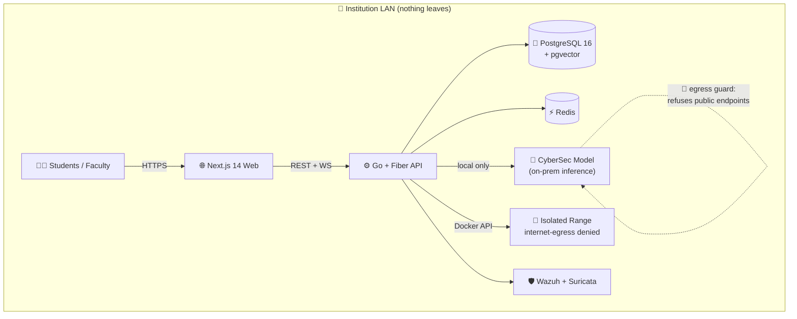

<!-- ══════════════════════════════════════════════════════════════════ -->
<!--                         CYBERRANGE  OS                             -->
<!-- ══════════════════════════════════════════════════════════════════ -->

<p align="center">
  
</p>

<p align="center">
  <a href="https://git.io/typing-svg">
    
  </a>
</p>

<p align="center">
  
  
  
  
</p>

<p align="center">
  
  
  
  
  
  
</p>

---

## ⬇️ Download the model & dataset

> The **CyberSec** model is a compact, department-specialized LLM that runs
> **fully on your own hardware**. Weights and training data are published as a
> GitHub Release so anyone can reproduce our lab assistant.

<p align="center">
  <a href="https://github.com/MD-HACKER07/CyberRange-OS/releases/latest/download/cyberrange-sec.gguf">
    
  </a>
  &nbsp;
  <a href="https://github.com/MD-HACKER07/CyberRange-OS/releases/latest/download/cyberrange-dataset.zip">
    
  </a>
</p>

<p align="center">
  <a href="https://github.com/MD-HACKER07/CyberRange-OS/releases/latest">
    
  </a>
</p>

| Artifact | File | Size | Notes |
|----------|------|------|-------|
| 🧠 **CyberSec model** | [`cyberrange-sec.gguf`](https://github.com/MD-HACKER07/CyberRange-OS/releases/latest/download/cyberrange-sec.gguf) | ~940 MB | Quantized GGUF, CPU-friendly, runs offline |
| 📚 **Training dataset** | [`cyberrange-dataset.zip`](https://github.com/MD-HACKER07/CyberRange-OS/releases/latest/download/cyberrange-dataset.zip) | ~0.3 MB | ~1,325 instruction pairs + eval split + data card |

> 🔒 **Privacy:** the published dataset contains **only public MITRE ATT&CK
> knowledge and synthetic teaching examples** — no student records, timetables,
> or personal data. Real institutional data never leaves the campus network.

---

## ✨ What is CyberRange OS?

An **AI-augmented Red Team / Blue Team training platform** for a college
cybersecurity lab. Self-hosted end-to-end, with a **locally-hosted** open-weight
LLM (**CyberSec**) so no student data, lab logs, or exploit attempts ever leave
the institution network.

Students practise — under supervision — both **offensive** security (recon,
exploitation, reporting against isolated vulnerable targets) and **defensive**
security (SOC-style log triage, incident response). Every exercise produces
structured evidence — command logs, rubric-graded reports, MTTD/MTTR metrics —
that maps to Course Outcomes / Programme Outcomes for **NBA** accreditation and
aggregates innovation evidence for **NAAC**.

---

## 🧭 Architecture at a glance



<details>
<summary>📁 <b>Repository layout</b> (click to expand)</summary>

```
/apps
  /web                 Next.js 14 (App Router) + TypeScript + Tailwind ("Vault" theme)
  /api                 Go + Fiber modular monolith (all backend subsystems)
/packages
  /ui                  Vault design-system reference
  /shared-types        Shared TS enums / envelopes
/infra
  docker-compose.yml         platform services
  docker-compose.range.yml   per-session isolated range template
  docker-compose.deploy.yml  single-server production deployment
  api.Dockerfile             Go API + seed (with headless Chromium for PDFs)
  kali/Dockerfile            Kali attacker image
/training              QLoRA fine-tuning kit that produces the CyberSec model
/docs
  architecture.md  runbook.md  TECHNICAL.md  PRESENTATION.md  FLOW_DIAGRAMS.md
```
</details>

---

## 🚀 Feature coverage

| Module | Highlights |
|--------|-----------|
| 🔐 **Auth & RBAC** | JWT with rotating refresh, institution OIDC SSO + local fallback, four roles, append-only audit trail |
| ⚔️ **Red Team range** | Docker per-session provisioning on an egress-denied network, browser terminal, full command logging, **CyberSec pentest copilot** (suggest → **Approve & Run** → execute), MITRE auto-tagging |
| 🧠 **LLM Gateway** | Local-inference-only guard (refuses public endpoints), config-driven model registry, versioned prompts, streaming, per-session token budgets, full prompt/completion logging |
| 🛡️ **Blue Team SOC** | Wazuh + Suricata ingestion into a common alert schema, live alert console, **CyberSec SOC copilot** summaries/verdicts, MTTD/MTTR timers, playbooks, accuracy tracking |
| 🎯 **MITRE ATT&CK engine** | Dataset ingest, pgvector semantic search, LLM disambiguation, technique tracker |
| 📝 **Reporting** | Markdown editor + live preview, AI grading assistant (faculty score authoritative), PDF + portfolio export |
| 📊 **Accreditation analytics** | CO/PO matrix, weighted attainment, heatmap, NBA CSV + NAAC evidence exports, course-exit surveys |
| 🔎 **AI Security** | PyRIT / Garak-style probe battery run against the institution's own local model; results dashboard |
| 🏆 **Gamification** | XP weighted by difficulty & inverse copilot reliance, red/blue/combined leaderboards, pluggable CTF feed |
| 🛠️ **Admin & observability** | Range target provisioning, LLM registry, RBAC, audit viewer (CSV), system health, Prometheus + Grafana |

---

## ⚡ Quick start

```bash
# 1) Clone
git clone https://github.com/MD-HACKER07/CyberRange-OS.git
cd CyberRange-OS

# 2) Configure secrets
cp .env.example .env          # set JWT_SECRET, SEED_ADMIN_PASSWORD, LLM_BASE_URL

# 3) Bring up the platform
docker build -t cyberrange/kali-attacker:latest infra/kali
docker compose -f infra/docker-compose.yml up -d --build
```

### 🧠 Add the CyberSec model

```bash
# Download the published weights (see the buttons above)
curl -L -o cyberrange-sec.gguf \
  https://github.com/MD-HACKER07/CyberRange-OS/releases/latest/download/cyberrange-sec.gguf

# Register it on your local model runtime, then add it in
# Admin → LLM Registry and assign it to modules. That's it —
# every module now answers from your own on-prem CyberSec model.
```

Open **http://localhost:3000**. See [`docs/runbook.md`](docs/runbook.md) for
full operations and [`docs/architecture.md`](docs/architecture.md) for design.

---

## 🧑‍💻 Local development

```bash
# Backend (needs local Postgres w/ pgvector + Redis, or run the infra compose):
cd apps/api
go run ./cmd/api            # applies migrations + seeds on boot
go test ./...

# Frontend:
cd apps/web
npm install
npm run dev                 # proxies /api to NEXT_PUBLIC_API_BASE
```

---

## 🧠 Train your own CyberSec model

The [`/training`](training) folder is a complete **QLoRA fine-tuning kit** that
turns a small open-weight base model into your department's assistant:

```
[1] Build dataset  →  [2] QLoRA fine-tune (free cloud T4)  →  [3] Export GGUF  →  [4] Register in Admin → LLM Registry
   data/*.jsonl          finetune_qlora.ipynb                  merge + quantize     assign to modules
```

Full recipe: [`training/README.md`](training/README.md) ·
[`training/STEPS.md`](training/STEPS.md) · data card in the dataset zip.

---

## 🔒 Safety guarantees (non-negotiable)

- 🎯 Attack targets come from a **pre-registered dropdown only** — no free-text
  host field exists anywhere in the UI or API.
- 🚫 Range networks are provisioned with **no route to the public internet**.
- ✋ The copilot **never auto-executes** — a human clicks **Approve & Run**, and
  every approved action is logged with student, target, timestamp, and command.
- 🧠 All LLM traffic goes to a **private** `LLM_BASE_URL`; the gateway **refuses
  to start** if that resolves to a public IP.
- 🔐 No student data, logs, or exploit attempts ever leave the campus network.

---

<p align="center">
  
</p>
