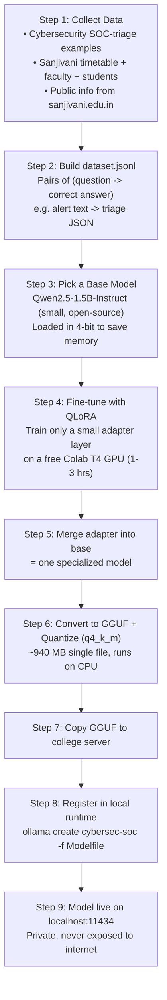
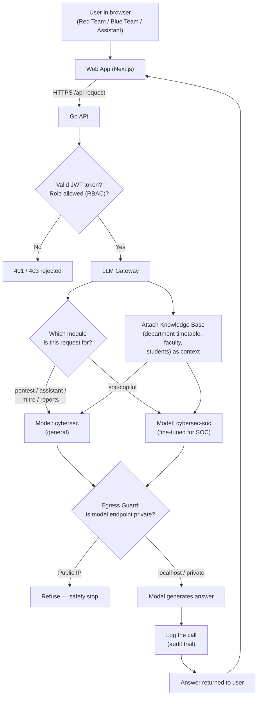
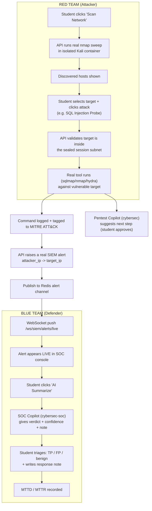
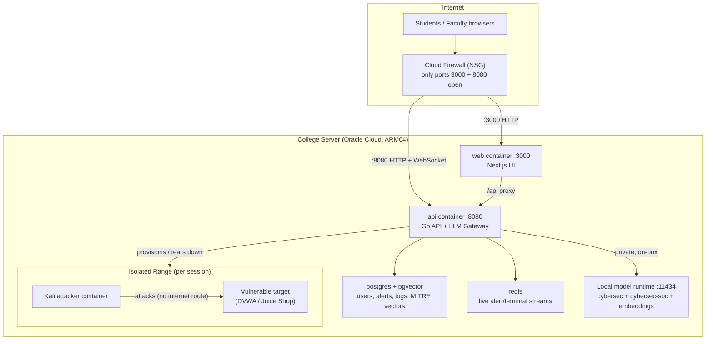

# CyberRange OS — Detailed Flow Diagrams (with Explanations)

Four labelled, end-to-end flow diagrams that explain how the platform and the
**CyberSec** model work. Each diagram is followed by a step-by-step English
explanation. These are presentation/viva ready.

> The diagrams are written in **Mermaid** (renders automatically on GitHub,
> VS Code with a Mermaid plugin, or mermaid.live) **and** in plain ASCII so they
> read fine anywhere.

---

## Diagram 1 — How the CyberSec Model Was Built (Training Pipeline)

This shows the full lifecycle from raw data to a running model on our server.



**ASCII version:**
```
[Collect Data] -> [Make dataset.jsonl] -> [Pick base model: Qwen2.5-1.5B]
      -> [Fine-tune with QLoRA on Colab GPU] -> [Merge adapter into base]
      -> [Convert to GGUF + quantize (~940MB)] -> [Copy to server]
      -> [Register in local runtime] -> [Live on localhost:11434 (private)]
```

### Explanation (Diagram 1)
1. **Collect data** — We gathered two kinds: (a) cybersecurity examples for SOC
   alert triage, and (b) real Sanjivani CY department data (timetables, faculty,
   127 students, university details from the official site).
2. **Build the dataset** — All examples were turned into a `dataset.jsonl` file:
   thousands of *(input question → correct answer)* pairs the model learns from.
3. **Pick a base model** — Instead of building from scratch (needs crores of
   rupees + huge GPUs), we took a small, ready-made open model,
   `Qwen2.5-1.5B-Instruct`, loaded in 4-bit to fit a free GPU.
4. **Fine-tune with QLoRA** — We trained only a tiny **adapter** on top of the
   frozen base model. This is cheap and fast — done in 1–3 hours on a free
   Google Colab T4 GPU.
5. **Merge** — The trained adapter is merged back into the base model, giving
   one specialized model.
6. **Convert + quantize** — We exported it to **GGUF** format and quantized to
   4-bit (`q4_k_m`), shrinking it to ~940 MB so it runs even on CPU.
7. **Copy to server** — The single `.gguf` file is copied to the college server.
8. **Register** — The local runtime loads the file and names it `cybersec-soc`.
9. **Live** — The model now serves on `localhost:11434`, fully private — no data
   ever leaves the institution.

---

## Diagram 2 — How a User Request Is Answered (Runtime Routing)

This shows what happens when anyone (student/faculty) asks the AI anything.
The key idea: a **Gateway** decides *which* model to use and enforces safety.



**ASCII version:**
```
User -> Web App -> Go API -> [Auth + RBAC check]
                                   |
                                   v
                             [LLM Gateway]
                            /             \
              module = soc-copilot?    other modules?
                    |                        |
             cybersec-soc               cybersec (general)
                    \                        /
                     + Knowledge Base context
                                   |
                        [Egress Guard: private only]
                                   |
                          [Generate answer] -> [Log call] -> User
```

### Explanation (Diagram 2)
1. **User → Web → API** — The browser sends the question to the Go API through
   the web app.
2. **Auth + RBAC** — The API checks the user's JWT token and role. No token or
   wrong role → rejected (401/403).
3. **LLM Gateway** — The central "manager". It looks at **which module** the
   request belongs to.
4. **Model selection** — SOC triage requests go to the fine-tuned
   `cybersec-soc`; everything else (pentest copilot, assistant, MITRE tagging,
   reports) goes to the general `cybersec`. *(This split fixed a real bug where
   the SOC-tuned model returned empty answers for non-SOC formats.)*
5. **Knowledge Base** — For department questions, the Gateway attaches the
   Sanjivani knowledge base (timetable, faculty, students) as context so the
   model answers accurately.
6. **Egress Guard** — Before generating, a safety check confirms the model
   endpoint is private (localhost). If it ever pointed to a public IP, it
   refuses — guaranteeing data stays on-premise.
7. **Generate → Log → Respond** — The model produces the answer, the call is
   written to an append-only audit log, and the answer goes back to the user.

---

## Diagram 3 — Red Team Attacks → Blue Team Sees It Live (End-to-End Exercise)

This is the core teaching loop: a student attacks in a sandbox, and another
student defends in real time. Both sides are assisted by the CyberSec model.



**ASCII version:**
```
RED TEAM                                     BLUE TEAM
--------                                     ---------
Scan Network                                 (waiting on live feed)
   |                                              ^
Pick target + Attack (sqlmap/nmap/hydra)          |
   |                                              |
Real tool runs in ISOLATED sandbox               |
   |----> logged + MITRE tag                      |
   |----> Pentest Copilot suggests next step      |
   |                                              |
   '----> API raises SIEM alert (attacker->target)|
              |                                   |
           Redis channel --> WebSocket -----------'
                                                  |
                                        Alert appears LIVE
                                                  |
                                        "AI Summarize" -> SOC Copilot verdict
                                                  |
                                        Student triages TP/FP + note
                                                  |
                                        MTTD / MTTR recorded
```

### Explanation (Diagram 3)
1. **Scan** — The Red Team student clicks *Scan Network*; the API runs a real
   `nmap` sweep inside an **isolated Kali container** and shows discovered hosts.
2. **Attack** — The student picks a target and an attack (e.g. SQL Injection
   Probe). The API first **validates** the target is inside the sealed
   per-session subnet — attacking outside is structurally impossible.
3. **Real execution** — A real tool (`sqlmap`, `nmap`, `hydra`, etc.) runs
   against the vulnerable target. The command is **logged** and auto-tagged to a
   MITRE ATT&CK technique.
4. **Copilot help** — The **Pentest Copilot** (general `cybersec` model)
   suggests the next logical step; the student must approve before it runs.
5. **Alert generation** — The same action makes the API raise a **real SIEM
   alert** correlating attacker IP → target IP.
6. **Live delivery** — The alert is published to a Redis channel and pushed over
   a WebSocket to the Blue Team console — it appears **instantly**.
7. **Defend** — The Blue Team student clicks *AI Summarize*; the **SOC Copilot**
   (fine-tuned `cybersec-soc`) returns a verdict + confidence + incident note.
8. **Triage + metrics** — The student labels the alert (True/False Positive /
   benign) and writes a response; **MTTD/MTTR** (time to detect/respond) are
   recorded for grading.

---

## Diagram 4 — Deployment Architecture (What Runs Where)

This shows the physical layout on the college server — every box is one running
piece, and how they connect.



**ASCII version:**
```
             Internet
   Students/Faculty browser
             |
      [Cloud Firewall NSG]  (only 3000 + 8080 open)
        |               |
     :3000 HTTP     :8080 HTTP+WS
        |               |
   [web :3000] --/api-> [api :8080  Go API + Gateway]
                              |   |   |        \
                              |   |   |         \--> [Isolated Range]
                              |   |   |               Kali --> Target (no internet)
                              |   |   |
                        [postgres] [redis] [local model :11434]
                        (data)     (live)  (cybersec + cybersec-soc)
                                            ^ private, on-box only
```

### Explanation (Diagram 4)
1. **Internet + Firewall** — Users reach the server over the internet, but the
   **cloud firewall (NSG)** only allows two ports: **3000** (web) and **8080**
   (API + WebSockets). Everything else is closed.
2. **web container (:3000)** — The Next.js UI the users see. It proxies API
   calls to the API container.
3. **api container (:8080)** — The Go API and the LLM Gateway. This is the brain
   — auth, routing, orchestration, and talking to the model.
4. **postgres + pgvector** — Stores users, alerts, command logs, reports, and
   the MITRE ATT&CK vectors used for semantic tagging.
5. **redis** — Powers the live streams (terminal output, alert feed) via
   publish/subscribe.
6. **Local model runtime (:11434)** — Serves both models (`cybersec` and
   `cybersec-soc`) plus the embedding model. It is reached **only from inside**
   the server (private) — never exposed to the internet.
7. **Isolated Range** — For each session, the API provisions a **sealed
   network** containing a Kali attacker and a vulnerable target. The attacker
   can reach the target but **has no route to the internet**, so exercises are
   completely contained.

---

## One-line takeaways (for the panel)

- **Diagram 1:** We didn't build from scratch — we fine-tuned a small open model
  (QLoRA) on our own data and host it locally as GGUF.
- **Diagram 2:** A Gateway routes each request to the right model, adds
  department knowledge, and guarantees inference stays on-premise.
- **Diagram 3:** Red Team actions become live Blue Team alerts in real time —
  both sides AI-assisted, everything logged and MITRE-tagged.
- **Diagram 4:** Everything runs on one college server, isolated and private,
  with only two ports open to the world.
